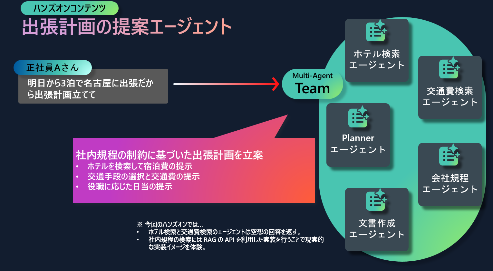

# Multi Agent workshop - Azure x AutoGen 編

## ワークショップ概要

このワークショップでは、Multi Agent フレームワークの AutoGen と Azure Functions を利用し、以下の構成のサンプルアプリケーションをもとに開発の基礎を学ぶことができます。

## アジェンダ

### 1. イントロダクション

ここでは講師の解説をもとに、参加者全員でハンズオンを進めていきます。

No | タイトル(ドキュメントリンク) | 概要
--- | --- | ---
1-1 | [ローカル開発環境の準備](./docs/get-started.md) | Codespace を使ったローカル開発環境・デバッグ実行の準備をします。
1-2 | コードの解説 | Azure Functions のサンプルコードをデバッグ実行しながら、AutoGen で構成されたコードの全体像や基本構成を講師が解説します。

### 2. Self-paced contents

ここからは、時間の許す限りドキュメントに沿って自身のペースでハンズオンを進めます。

No | タイトル(ドキュメントリンク) | 概要
--- | --- | ---
2-1 | [Company Rules Agent の変更](./docs/implement-rag-agent.md) | Agent 実装の実践として、Function Calling の Agent の実装方法の基礎を学びます。
2-2 | [Azure Functions へのデプロイ](./docs/deploy-to-function-app.md) | ここまで実装した Function App を Azure へデプロイする方法を学びます。
2-3 | [Advanced contents](./docs/advanced-content.md) | さいごに AutoGen で開発を進めていくうえで、次にキャッチアップしておきたい必須の知識のドキュメントを紹介します。
