# Self-paced handson: Azure Functions へのデプロイ

## 📝ここで学ぶこと

- VS Code から AutoGen で実装したアプリケーションを Azure の Function App へデプロイ方法
- Azure Portal から Function App の実行方法
- Application Insights のライブメトリックでのログの確認方法

## 📝前提条件

ここまではワークショップ運営側の Azure サブスクリプションの AI モデルを利用して実行していました。
ここから自身の Azure サブスクリプションにある Azure の Function App デプロイするにあたり、AI のモデルのリソースも自身で用意していただく必要があります。

それに合わせて手順の最初にリソース作成を行います。

> [!CAUTION]
> Azure のリソース作成をする場合、多少の料金が発生しますので、自己責任で作成・削除の判断をお願いいたします。


## ⚗️Azure のリソース準備

今回のワークショップでは以下のリソースを作成します。ただし、Azure へのデプロイは必須ではありません。
**多少の料金は発生しますので、ご自身でリソースの作成や削除を行ってください。**

- Azure Functions (Function App のリソースに必須の Consumption plan, storage account を含む)
- Application Insights (+ Log Analytics workspace)

### 事前準備: Azure へのログイン

ブラウザーの別タブで Azure portal を開き、今回のワークショップで利用する Azure のディレクトリにログインしておきます。
事前にログインしておくことで、想定外のディレクトリ・サブスクリプションでのリソース作成を予防することが目的です。

### Azure のリソース準備: Azure Functions の作成

以下の `Deploy to Azure` のボタンを `CTRL` キー (Mac の場合 `CMD`) を押しながらクリックすることで、別タブで Azure portal に遷移してカスタムデプロイの画面が開きます。

<a href="https://portal.azure.com/#create/Microsoft.Template/uri/https%3A%2F%2Fstyokosandbox.blob.core.windows.net%2Farm-templates%2Fautogen-workshop-consumption-short.json" target="_blank" rel="noopener noreferrer"></a>

カスタムデプロイ画面では、以下を参考に入力し、"確認と作成" (⑥)をクリックします。

No. | 項目 | 入力内容
---: | --- | ---
1 | 開いている Azure のディレクトリ | ハンズオンで利用するディレクトリであることを確認します。異なる場合は正しいディレクトリを変更します。
2 | サブスクリプション | ハンズオンで利用するサブスクリプションを選択します。
3 | リソース グループ | 既存で使うリソースグループがある場合は選択します。新たに作成したい場合は "新規作成" を選択して名称を入力します。
4 | リージョン | ハンズオンで利用するリージョンを選択します。Azure OpenAI のセットアップで説明した通り "East US" を推奨していますが、自身で判断して利用するリージョンを選択してください。
5 | Name Prefix | リソースにつける任意のプリフィックスを入力します。文字列と数字のみで入力してください。

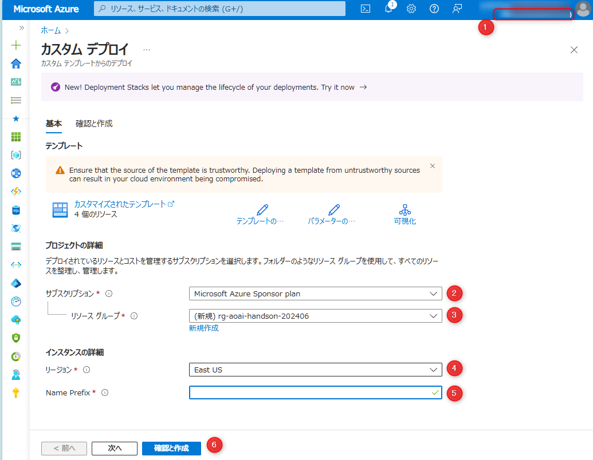


"確認と作成" タブで "作成" ボタンをクリックすると、リソースの作成が開始されます。リソースの作成には数分かかりますので、しばらくお待ちください。

リソースが作成できたら、"リソースグループに移動" をクリックして、作成したリソースを確認できます。

### Azure のリソース準備: Azure AI 関連のリソース作成

ここまでのワークショップでは、Azure 上への LLM のリソースへのアクセスは、ワークショップ運営側のリソースを利用していました。
そのため、自身の環境の Azure Functions へデプロイして利用する場合は、LLM に関するリソースも自身で作成する必要があります。

そのため Azure AI Foundry のリソースを作成し、sample.settings.json.sample を参考に必要な情報を取得してください。

> [!NOTE]
> ワークショップ作成時点では日本語のドキュメントがないため英語のドキュメントリンクになります。  
> Azure / Azure AI に不慣れな場合は、お気軽にトレーナーにリソースの作成方法をお尋ねください。
>
> - [How to deploy Azure OpenAI models with Azure AI Foundry | Microsoft Docs](https://learn.microsoft.com/ja-jp/azure/ai-foundry/how-to/deploy-models-openai)

## ⚗️Codespace で Azure へ Sign in

Codespace に戻り、左側のメニューの Azure アイコンをクリックして、Azure へのサインインを行います。

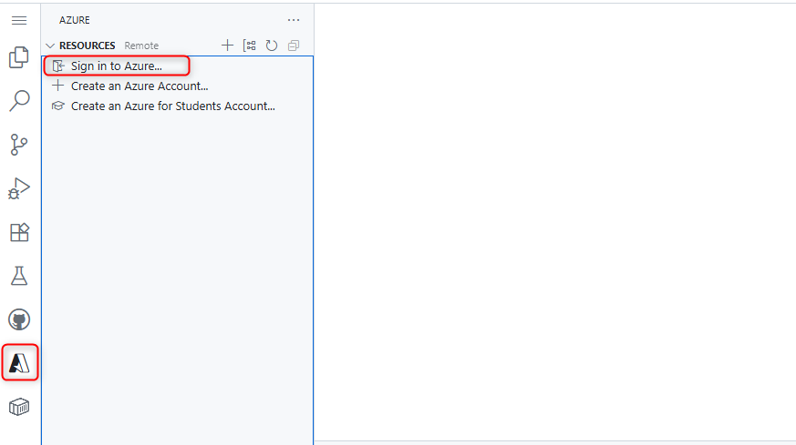

「拡張機能 'Azure Resources' が Microsoft を使用してサインインしようとしています。」というポップアップが表示されますので、「許可」をクリックします。  
別タブで Azure へのサインイン画面が開きますので、サインインします。正常にサインイン後、そのタブは閉じて Codespace に戻ります。


## ⚗️環境変数のアップロード

### VS Code から環境変数をアップロード

引き続き Codespace で作業を進めます。

アプリケーションをデプロイする前に、local.settings.json で正しく構成された環境変数を Azure の Function App にアップロードします。

VS Code でコマンドパレットを起動 (Ctrl + Shift + P または Cmd + Shift + P) して、"function upload" と入力して表示される「Azure Functions: Upload Local Settings...」を選択します。

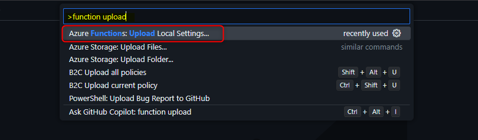

コマンドパレットでサブスクリプションの選択と Function App の選択が表示されますので、対象のリソースを選択します。
(選択肢が表示されるまで数秒かかることがあります)

### Azure Portal で環境変数を確認

以下手順で環境変数がアップロードされていることを確認します。

- Azure Portal で対象の Function App のリソースを開く
- 左側のメニューの「設定」配下にある「環境変数」をクリック

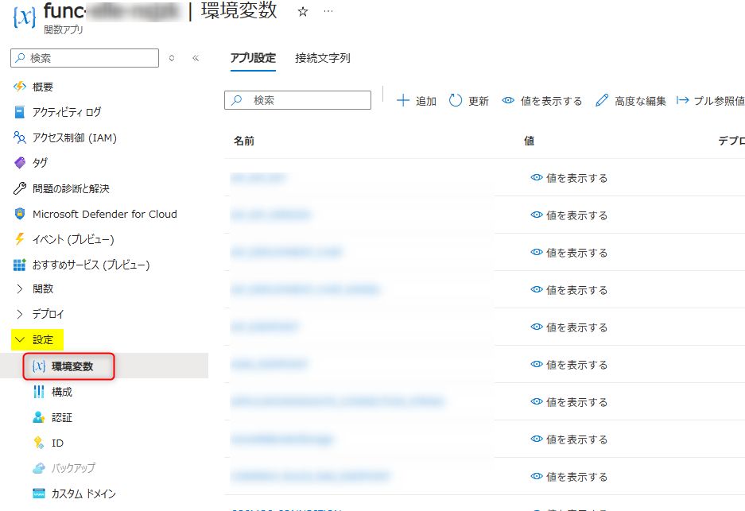

### ⚗️アプリのデプロイ

### VS Code から Function App をデプロイ

次に、アプリケーションをデプロイします。

VS Code でコマンドパレットを起動 (Ctrl + Shift + P または Cmd + Shift + P) して、"function deploy" と入力して表示される「Azure Functions: Deploy to Azure...」を選択します。

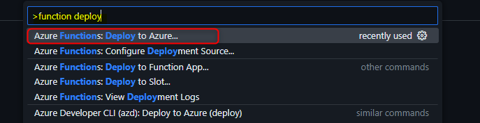

コマンドパレットでサブスクリプションの選択と Function App の選択が表示されますので、対象のリソースを選択します。

> [!NOTE]
> 選択肢が表示されるまで数秒かかることがあります。

数秒すると、以下のウインドウが表示されますので、「Deploy」をクリックします。

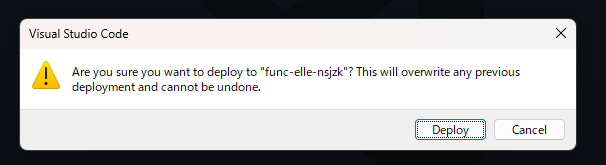

デプロイが始まると Azure のターミナルが表示されます。「Succeeded」が表示されるとデプロイは完了です。

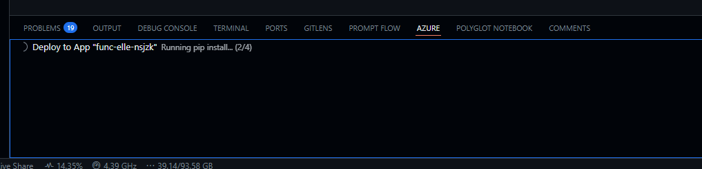

### Azure Portal で Function App を確認

以下の手順で Function App の Function がデプロイされていることを確認します。関数の一覧が反映されるのに30秒から3分程度かかることがありますので、ここで休憩をすることをおすすめします。

- Azure Portal で対象の Function App のリソースを開く
- 左側のメニューの「概要」を表示
- "関数" タブ内に「chat」が表示されていることを確認

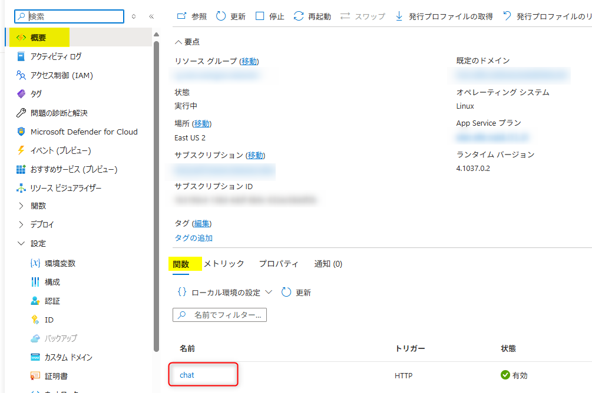

## ⚗️Azure 上で動作確認

デプロイした Function App の動作確認を行います。

動作確認は以下の観点で行います。

- Application Insights のライブメトリックでリアルタイムにログを確認
- Azure portal から Function App を起動して動作確認

### Application Insights のライブメトリックの表示

以下手順で Application Insights のライブメトリックを表示します。
Function App のリソースも同時に確認するため、ブラウザーの別タブで開きます。

- Azure Portal で同じリソースグループ内にある Application Insights のリソースを、**別タブで開く**
- 左側のメニューの「調査」セクション内の「ライブメトリック」をクリック

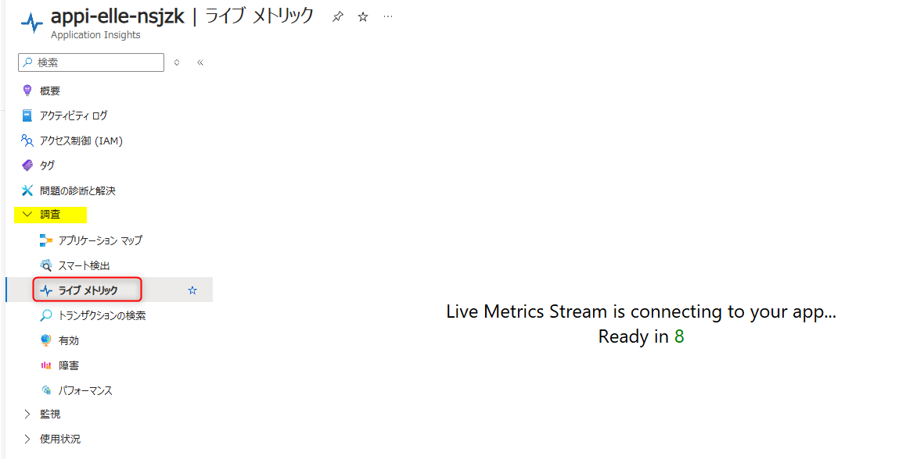

### Function App を実行

以下の手順で「コードとテスト」の画面を開きます。

- Azure Portal で Function App のリソースを開く
  - Application Insights とは別のタブで、Function App のリソースを開いている想定です。
- 左側のメニューの「概要」を表示して、画面中央 "関数" タブ内「chat」をクリック。
  

"Chat" の画面に遷移し "コードとテスト" 表示されますので以下の操作をします。

- 画面右下の「最大化」をクリックしてログの表示領域を最大化します。
- 「テスト/実行」をクリックします。

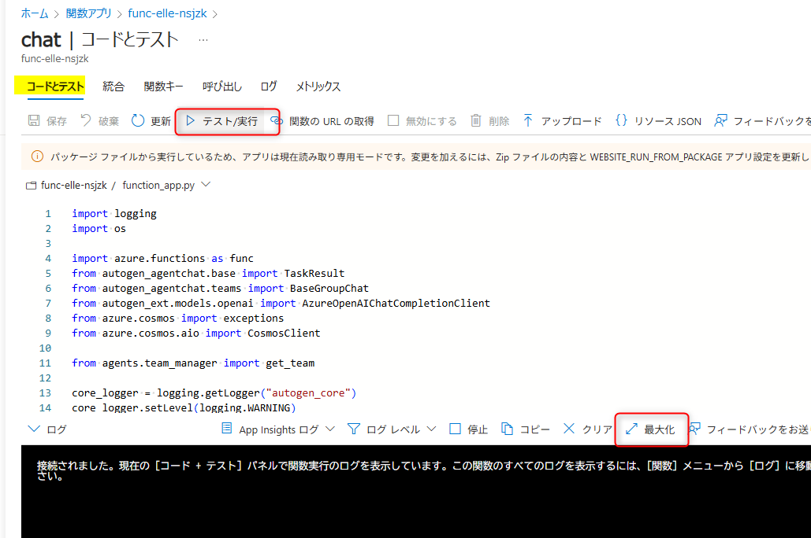

「テスト/実行」が表示されます。ので、以下の操作をします。

- HTTP メソッドは「POST」になっていることを確認
- 本文で以下を入力

```json
{
 "task": "私は正社員です。出発地は東京で、目的地は名古屋市で3月5日から3泊で出張計画を立ててください"
}
```

これで画面下部の「実行」をクリックすると、Function App へリクエストが送信されて、実行中はログが表示されます。

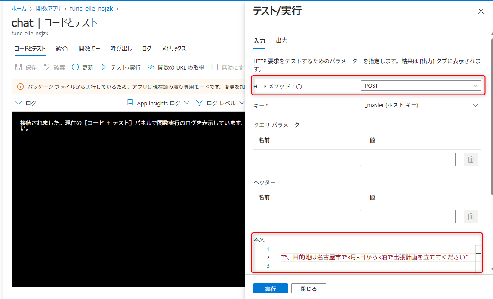

ブラウザーの別タブで開いている Application Insights のライブメトリックの画面でも、合わせて確認してみましょう。

## Congratulations🚀

おめでとうございます。これで VS Code から Function App をデプロイし、動作確認する方法を学びました。

> [!CAUTION]
> Azure のリソース作成をする場合、多少の料金が発生しますので、自己責任にてリソースの削除の判断をお願いいたします。

<br>

---

[📋 目次へ戻る](../README.md) | [⏭️ 次へ進む: Advanced contents](./advanced-content.md)


