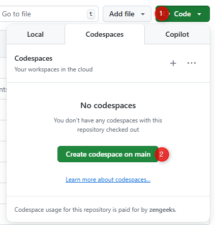
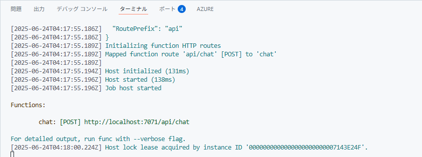
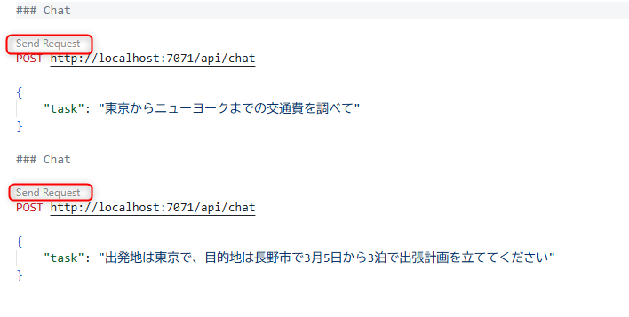

# ローカル開発環境の準備

ワークショップの前半では、デバッグ実行しながらコードの全体像の解説を行います。

ここでは、その準備として Codespace 上でのローカル開発環境の準備を行います。

## 準備

### Codespaces の起動


ここからは、Function App 専用の GitHub Codespaces を利用してハンズオンを進めます。  
今回のハンズオンの GitHub のリポジトリで、"Code" ボタンをクリック (①) → "Codespaces" をクリック (②) → "Create codespace on main" をクリックします。



Codespace が起動すると、repo の src フォルダーをルートして表示されます。以降ここで作業を進めます。

<br>

## デバッグの実行

表示された Codespace の src フォルダーは、Azure Functions で実装されたサンプルコードです。

- Codespace 上でターミナルを開きます。デフォルトで表示されているはずですが、表示されていない場合は以下の手順で表示します。
  - 画面左上のハンバーガーメニューから、またはショートカットキー (Windows: `CTRL` + `Shift` + `C`, Mac: `Cmd` + `Shift` + `C`) で起動します。
- 以下のコマンドを実行して必要なモジュールをインストールします。

```bash
pip install -r requirements.txt
```

以下のコマンドでデバッグの実行を開始します。

```
func start
```

> [!CAUTION]
> **デバッグ開始時に「タスク 'func: host start' を見つけられませんでした。」が表示された場合**
>
> VS Code のコマンドパレットを開き (Windows: `CTRL` + `Shift` + `P`, Mac: `Cmd` + `Shift` + `P`) 、「reload」と入力して表示される **開発者: ウィンドウの再読み込み" (Developer: Reload Window)** を実行することで解消する可能性が高いです。

ターミナルで、起動開始中にエラー表示がなく、最終的に以下図のように 「Host lock lease acquired by instance ID...」と表示されたデバッグが開始された状態です。




> [!TIP]
> 通常、Function App でローカルデバッグを実行する際は local.settings.json にシークレットや環境変数を設定して読み込みます。
> 今回のワークショップでは、Codespace のシークレットストアにそれらの情報が保存されているため動作します。
> このコードをこの repository の Codespace 以外の環境で実行する場合は、local.settings.json.sample を参考に、local.settings.json に正しくシークレットや環境変数を設定する必要があります。

<br>

## API を呼び出す

デバッグ実行が正常に開始したことを確認したら、動作確認を行います。

動作確認を行うために、**rest-local.http** を開きます。

> [!TIP]
> この 拡張子: `.http` のファイルは、VS Code の拡張機能により、HTTP リクエストを簡単に実行できます。

"Send Request" ボタンをクリックして、以下のリクエストを実行します。




トレーナーの解説から動作を把握し、質問を変えて動作を試してみましょう。


## デバッグを終了する

デバッグを終了するには、デバッグ実行しているターミナルで、`CTRL` + `C` を押します。

または、ターミナルを強制終了します。


[📋 目次へ戻る](../README.md)
